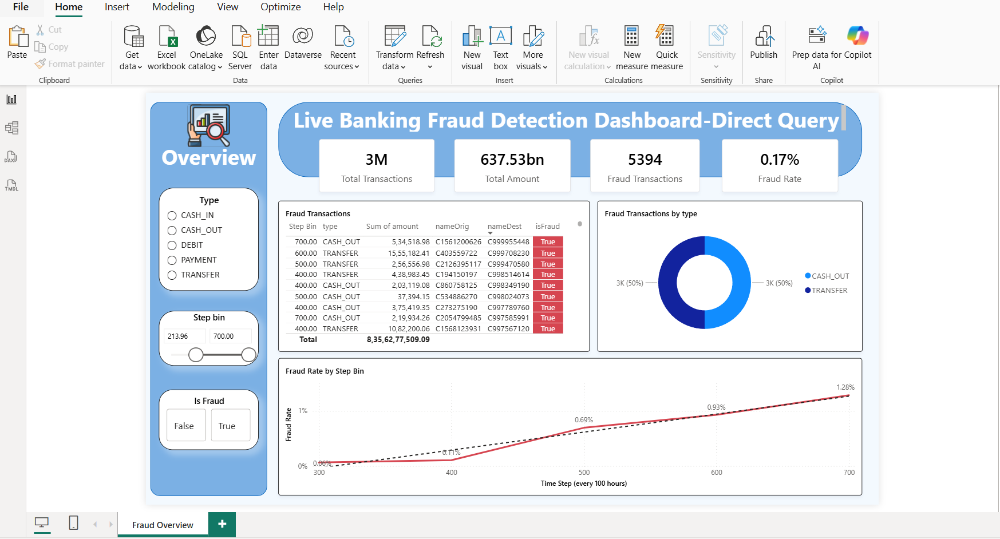
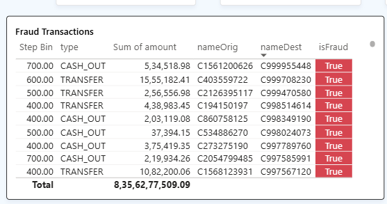
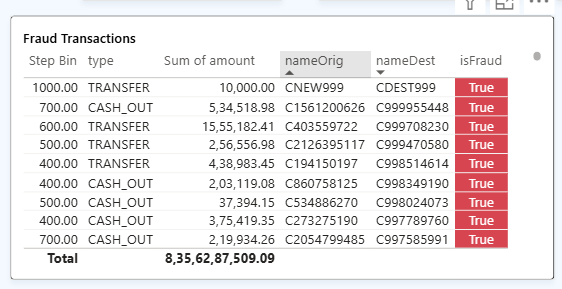

# Live Real-Time Banking Fraud Monitoring Dashboard

## Project Overview
This project demonstrates a **Real-Time Banking Fraud Monitoring Dashboard** built in Power BI using **DirectQuery** mode connected to a live SQL Server database. 
The dashboard enables instant detection and visualization of fraudulent transactions with live data updates, interactive filtering, and clear visual alerts

## Live Dashboard
https://app.powerbi.com/view?r=eyJrIjoiNjI5NTI1ZjMtODYyNS00ZTQyLTg5MTgtOGEyNTdhNGY1ZjIzIiwidCI6IjMxZDg4NTRiLTcxZTAtNDc1ZC1iOTY4LTdkYzE2MTE5N2RiNSJ9&pageName=bdede88698a0f9c3e6df

### Key Features
- Live connection to SQL database using **DirectQuery** (no data import)
- Real-time KPI cards (Total Transactions, Total Amount, Fraud Count, Fraud Rate)
- Interactive slicers for Type, Step Bin, and Is Fraud
- Trend analysis of fraud rate over time steps
- Fraud Transactions by Type (Donut Chart)
- High-Risk Transactions table with **conditional red highlighting** for fraudulent rows
- Live data pipeline demonstration (add row in SQL → instant update in dashboard)

## Technologies Used
- **Power BI Desktop** (DirectQuery mode)
- **SQL Server Express** + SSMS
- PaySim Synthetic Banking Dataset
- DAX Measures for fraud calculations

## How the Live Pipeline Works
## 1. Data Source Setup
- Connected to local SQL Server database (`FraudDB`)
- Used **DirectQuery** mode so every filter/slicer sends a live query to SQL
- No data is stored in Power BI — always fresh from source

### 2. Key Visuals
**Overview Page contains:**
- 4 KPI Cards showing Total Transactions, Total Amount, Fraud Transactions, and Fraud Rate
- Slicers: Transaction Type, Step Bin (time groups), Is Fraud (True/False)
- Line Chart: Fraud Rate trend over Step Bin
- Donut Chart: Fraud distribution by transaction type
- Table: Detailed transactions with **red background** when `isFraud = True`

### 3. Live Update Demonstration

**Before Adding New Row:**

**After Adding New Fraud Row in SQL:**

**Live fraud detection Steps:**
1. Open SSMS and run INSERT statement to add a new fraudulent transaction (step = 999, isFraud = 1)
2. Go back to Power BI report
3. Click any slicer or press F5
4. New row appears **instantly** in the table with **red highlighting**
This clearly demonstrates the **real-time data pipeline** using DirectQuery.

## How to Run This Project

1. Restore the PaySim dataset into SQL Server (`FraudDB`)
2. Open the `.pbix` file in Power BI Desktop
3. Change connection to your local SQL Server (DirectQuery mode)
4. Refresh and explore the interactive dashboard

## Key Learnings
- Working with **DirectQuery** for live data connections
- Building interactive dashboards with proper slicer interactions
- Conditional formatting for instant visual alerts
- Demonstrating real data pipeline from SQL → Power BI
- Handling large datasets efficiently

In the High-Risk Transactions table
Conditional formatting: When isFraud = True, row background turns red automatically.
It's "instant" because as soon as a new fraud row loads (from SQL via DirectQuery), the red appears right away—no manual click needed.

So when we added a test row (like step 999, isFraud=1), the table updated live, and that new row lit up red—that's the visual alert.
No fancy alerts (like "Fraud detected! Email sent")—just color coding for now.
  
## How to Use
Interactive via live dashboard link shared above as the .pbix file contains 6L+ rows it is difficult to upload
Open Live-Real-Time-Banking-fraud-Monitoring-Dashboard.pbix in Power BI Desktop
Explore the interactive slicers.

Feel free to star this repo if you find it useful!

Open to feedback & opportunities**
